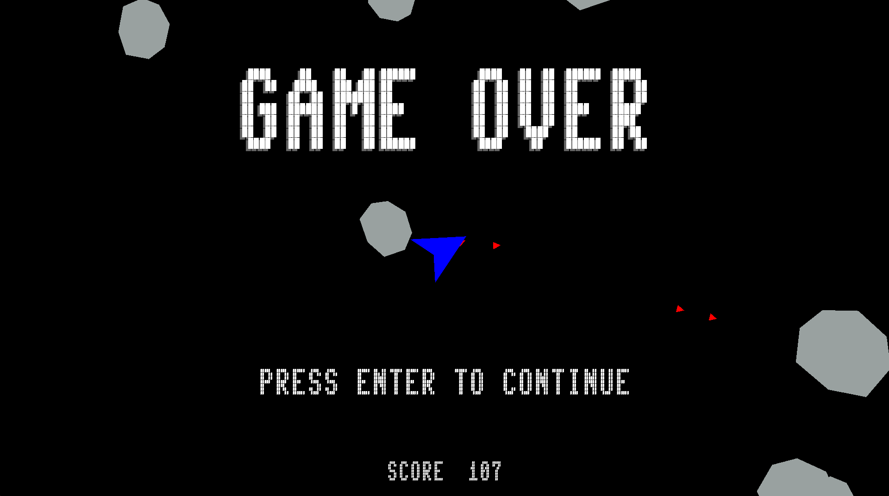
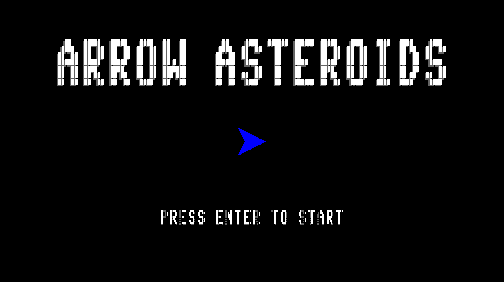
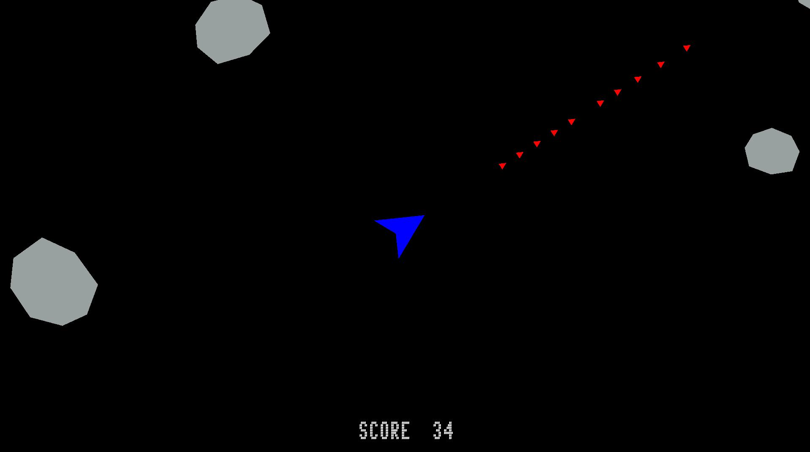

# Arrow Asteroids



Arrow Asteroids is a modern take on the classic arcade game Asteroids. Pilot your spaceship with arrow keys, blast away drifting asteroids, 
and strive for the highest score in this action-packed challenge.

## Features

- Control the arrow spaceship.
- Fire bullets to destroy asteroids.
- Track your score and challenge your high score.
- Collision detection for spaceship-asteroid collisions.

## Getting Started

1. Clone this repository:

   ```bash
   git clone https://github.com/chFleschutz/arrow-asteroids.git
   ```

2. Open the Visual Studio solution

3. Run the project and have Fun

## How to Play

1. Launch the game.
2. Press any key to start the game.
3. Use the arrow keys (Up, Down, Left, Right) to control your spaceship.
4. Press the CTRL-key to shoot bullets.
5. Avoid collisions with asteroids to stay alive.
6. Aim to destroy as many asteroids as possible to earn points.
7. Challenge yourself to achieve the highest score!

## Screenshots






